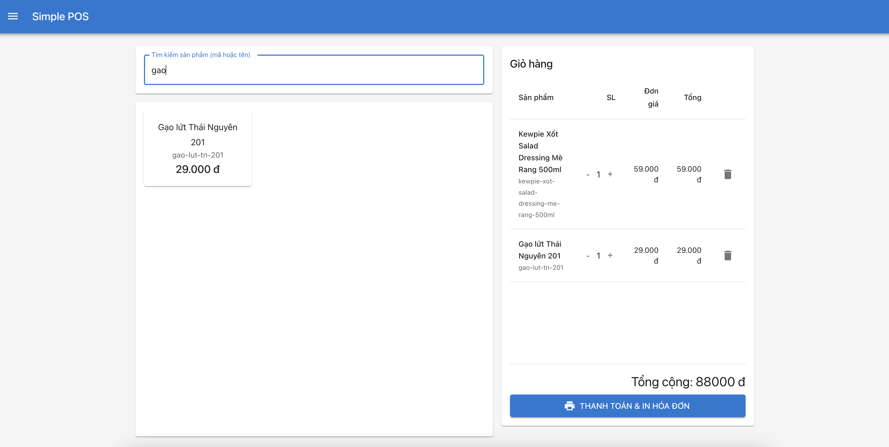
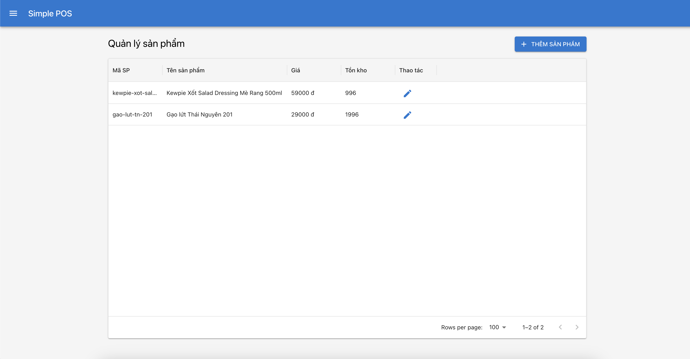

# POS APP (cloud webapp)

## Version 1



## Các tính năng chính:

- Tìm kiếm sản phẩm theo mã hoặc tên
- Thêm sản phẩm vào giỏ hàng
- Điều chỉnh số lượng trong giỏ hàng
- Tạo và in hóa đơn
- Quản lý kho theo dõi nhập/xuất
- Xem lịch sử hóa đơn và in lại
---
1. Backend (FastAPI + SQLite):
Quản lý sản phẩm (thêm, sửa, tìm kiếm)
Quản lý tồn kho (theo dõi nhập/xuất)
Quản lý hóa đơn (tạo, xem, in)
Full-text search cho tìm kiếm sản phẩm
API RESTful với tài liệu tự động (/docs)
2. Frontend (React + Material-UI):
Giao diện bán hàng (POS) với tìm kiếm và giỏ hàng
Quản lý sản phẩm với bảng dữ liệu phân trang
Xem lịch sử hóa đơn và in lại
Giao diện responsive, thân thiện người dùng
In hóa đơn tự động
Để chạy ứng dụng trong chế độ development:

3. Cách chạy
### Front end
- Cần cài sẵn NodeJS >18 + npm
- cd frontend
- npm install 
- ```npm start``
- Frontend sẽ chạy tại http://localhost:3000

### Backend
- Cần cài sẵn Python 3.10
- cd backend
- pip install -r requirements.txt
- Start temporal (worfklow): 
- ```temporal server start-dev```
- ```uvicorn app.main:app --reload --port 8000```
-- ```python -m app.run_worker```
- Backend API sẽ chạy tại http://localhost:8000
- API documentation có thể xem tại http://localhost:8000/docs

