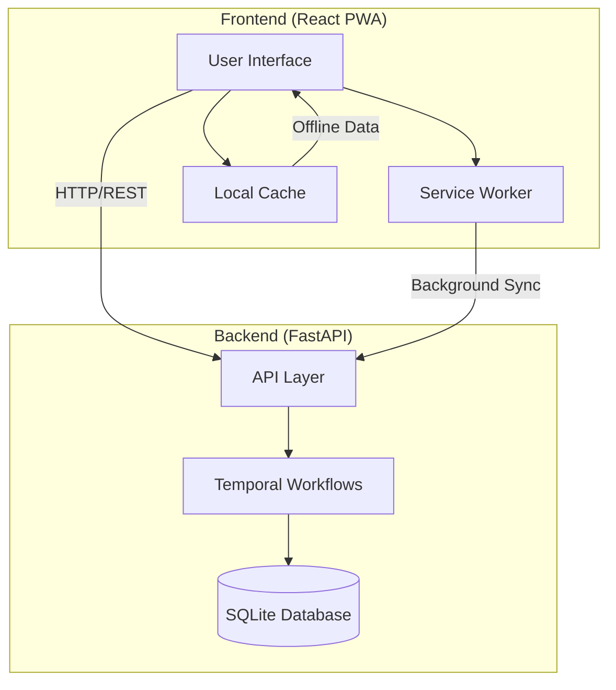
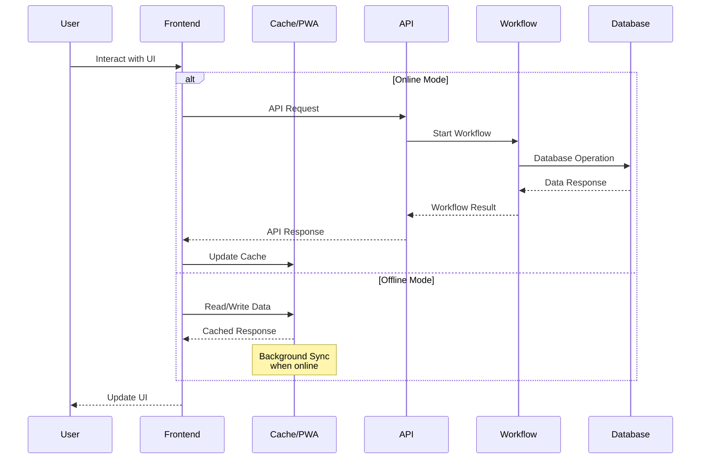
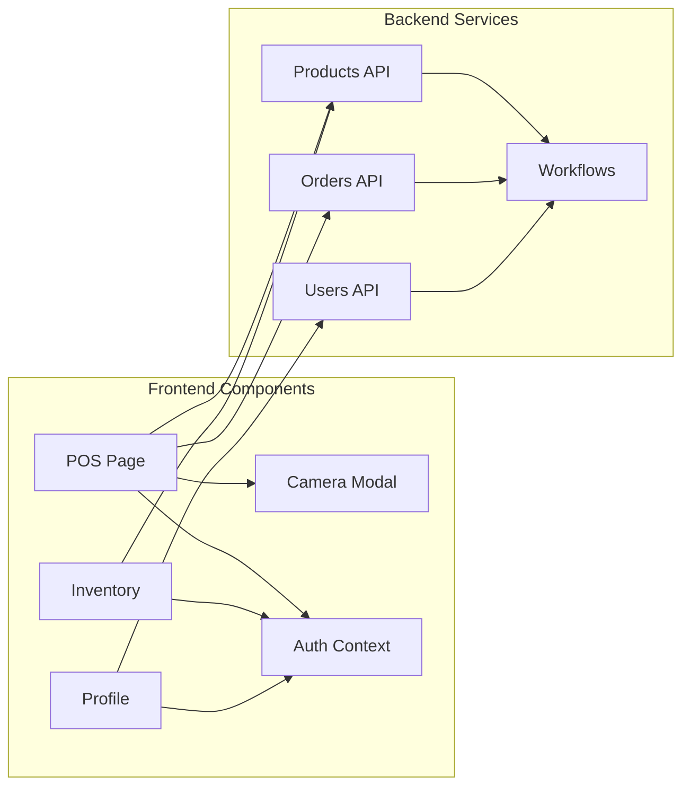
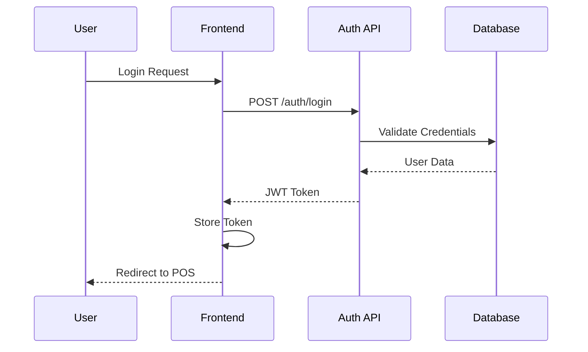
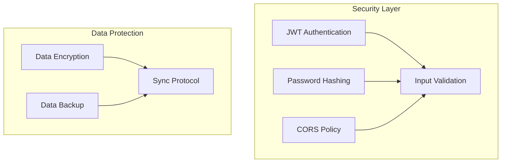

# System Architecture Overview

## High-Level System Architecture

## Data Flow Architecture

## Component Integration

## Authentication Flow

## Key Features & Technologies

### Frontend
- React 19.0.0 with Material-UI
- PWA capabilities for offline functionality
- Service worker for background sync
- Local storage for offline data persistence
- Responsive design for all devices

### Backend
- FastAPI for REST API endpoints
- Temporal.io for workflow orchestration
- SQLite database with SQLAlchemy ORM
- JWT authentication
- Background task processing

### Integration Points
- RESTful API communication
- JWT token-based authentication
- Background synchronization
- File upload/download handling
- Real-time updates (where applicable)

## Security Measures

This architecture ensures:
- Secure authentication and authorization
- Reliable offline functionality
- Scalable workflow management
- Efficient data synchronization
- Responsive user experience across devices
