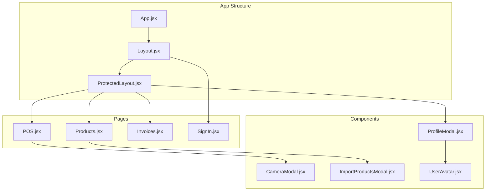
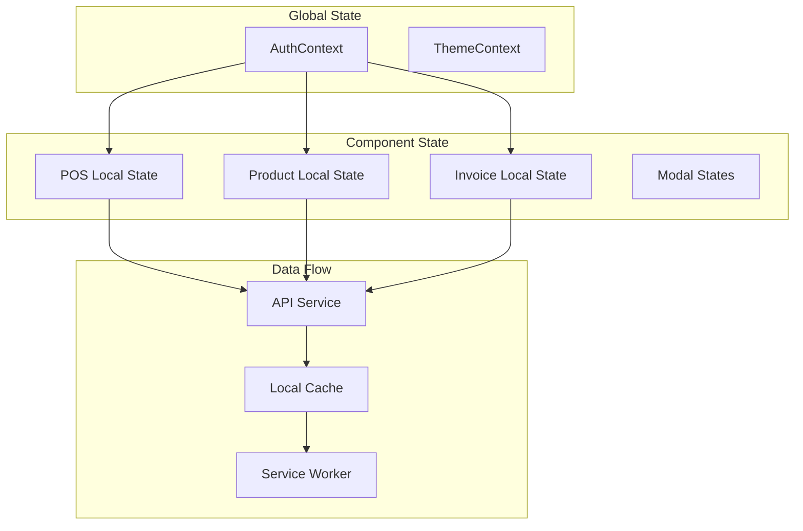
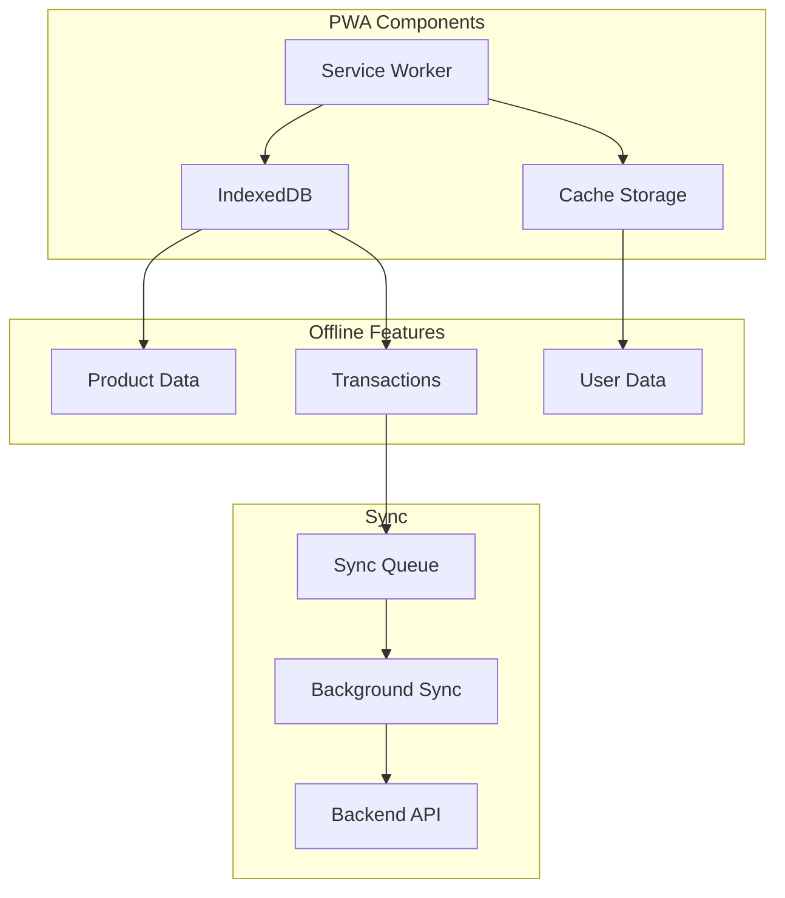
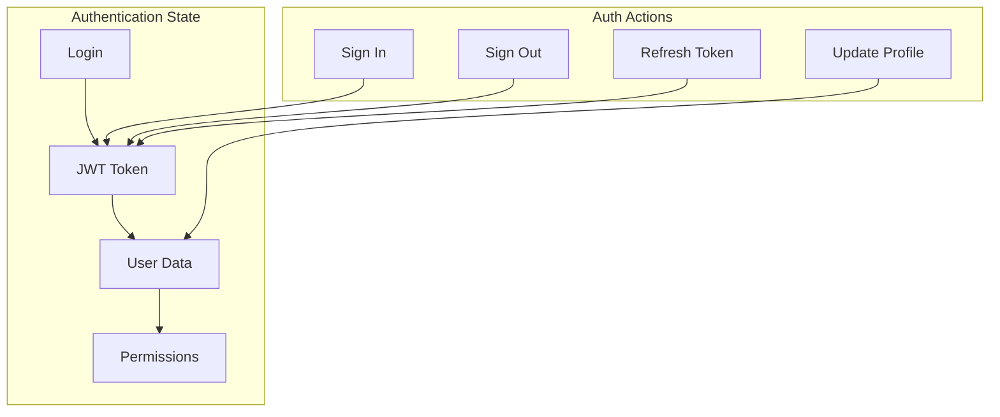
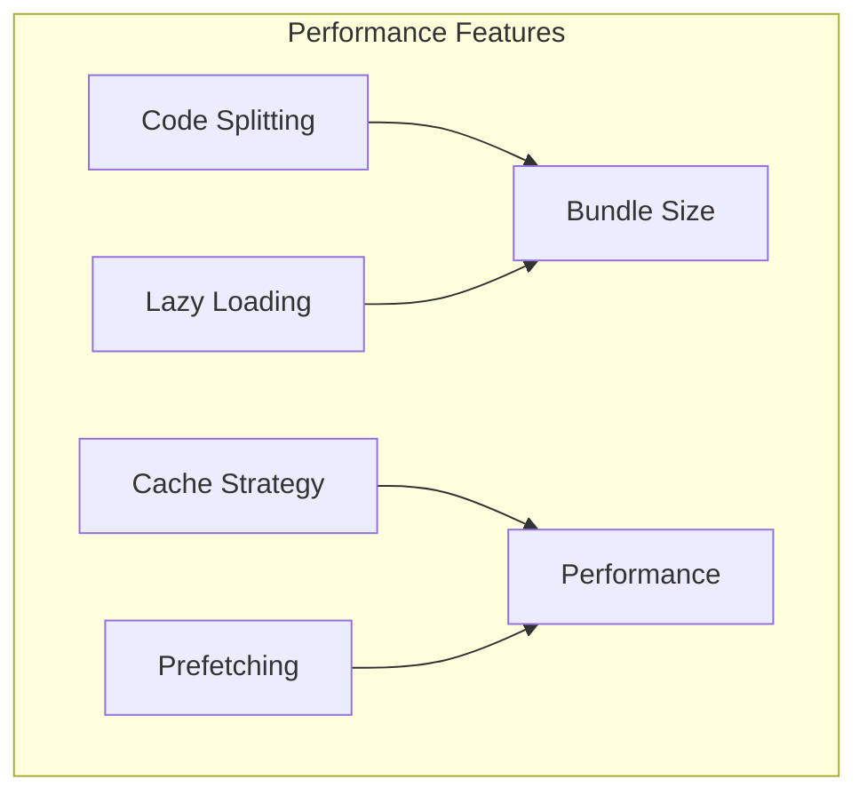

# Frontend Architecture

## Component Hierarchy



## State Management



## Routing Structure

```mermaid
graph LR
    subgraph "Public Routes"
        Sign[/signin]
    end

    subgraph "Protected Routes"
        POS[/pos]
        Prod[/products]
        Inv[/invoices]
        Prof[/profile]
    end

    Sign --> POS
    POS --> Prod
    POS --> Inv
    POS --> Prof
```

## PWA Architecture



## Component Details

### Core Components

1. **Layout.jsx**
   - Main application layout
   - Navigation structure
   - Theme management
   - Responsive design handling

2. **ProtectedLayout.jsx**
   - Authentication check
   - Route protection
   - User session management
   - Navigation guards

3. **UserAvatar.jsx**
   - Profile picture display
   - User status indicator
   - Click handling for profile modal

### Feature Components

1. **CameraModal.jsx**
   - Barcode/QR scanning
   - Camera access management
   - Image processing
   - Error handling

2. **ImportProductsModal.jsx**
   - File upload handling
   - Data validation
   - Progress indication
   - Error reporting

3. **ProfileModal.jsx**
   - User information display
   - Profile editing
   - Password management
   - Settings configuration

## State Management Patterns

### AuthContext


## Technical Implementation

### Frontend Technologies
- React 19.0.0
- Material-UI 6.4.3
- React Router DOM 7.1.5
- Emotion (CSS-in-JS)

### Development Tools
- Vite for build tooling
- ESLint for code quality
- Jest for testing
- React Testing Library

### PWA Features
- Service Worker registration
- Cache management
- Offline functionality
- Push notifications (where applicable)

## Performance Optimizations



This architecture ensures:
- Clean component hierarchy
- Efficient state management
- Robust offline capabilities
- Optimized performance
- Maintainable codebase
