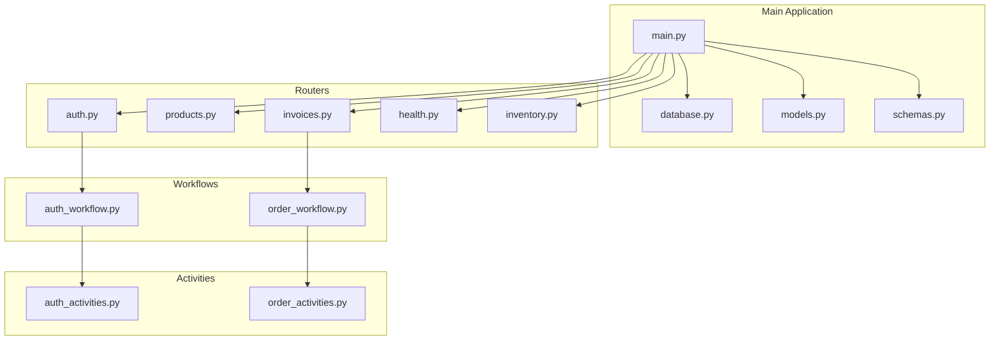
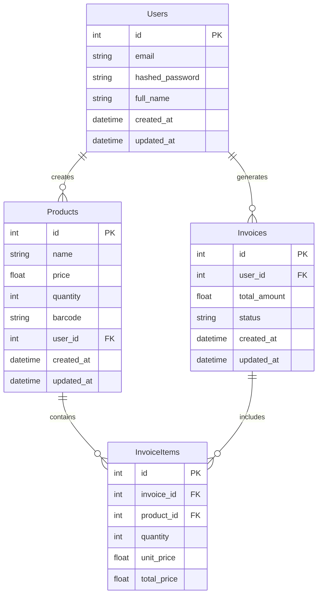
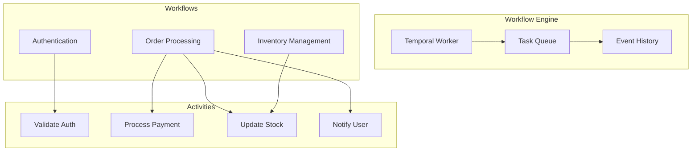
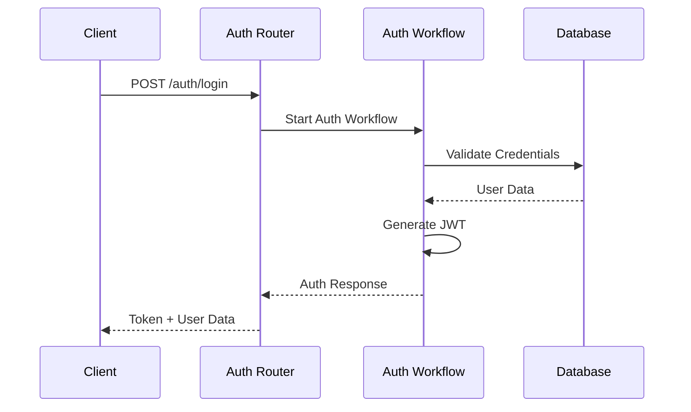
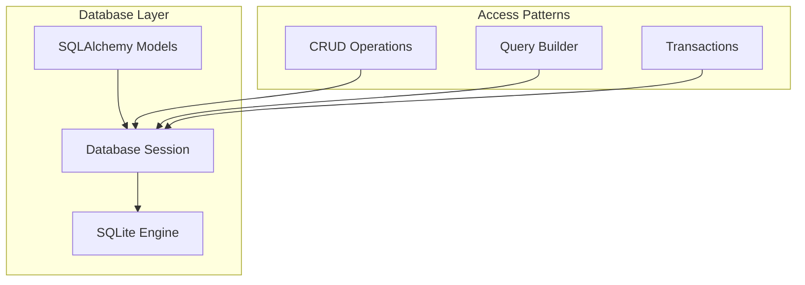
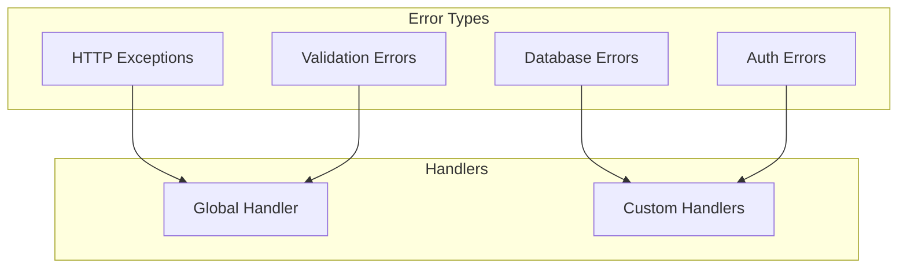

# Backend Architecture

## FastAPI Application Structure



## Database Schema



## Temporal Workflow Architecture



## API Endpoints Structure

```mermaid
graph LR
    subgraph "Authentication"
        Login[/auth/login]
        Register[/auth/register]
        Profile[/auth/profile]
    end

    subgraph "Products"
        GetProducts[/products]
        CreateProduct[/products/create]
        UpdateProduct[/products/update]
        DeleteProduct[/products/delete]
    end

    subgraph "Invoices"
        CreateInvoice[/invoices/create]
        GetInvoices[/invoices]
        GetInvoice[/invoices/{id}]
    end

    subgraph "Inventory"
        UpdateStock[/inventory/update]
        CheckStock[/inventory/check]
    end
```

## Authentication Flow



## Technical Implementation

### Core Technologies
- FastAPI 0.104.1
- SQLAlchemy 2.0.25
- Temporal.io
- Python 3.x
- SQLite

### Database Access


### Error Handling



## Security Implementation

### Authentication & Authorization
- JWT token-based authentication
- Password hashing with passlib
- Role-based access control
- Session management

### Data Protection
- Input validation with Pydantic
- SQL injection prevention
- CORS configuration
- Rate limiting

## Development Tools
- uvicorn for ASGI server
- pytest for testing
- black for code formatting
- mypy for type checking

This architecture ensures:
- Clean separation of concerns
- Scalable workflow management
- Secure authentication and data handling
- Efficient database operations
- Maintainable codebase structure
