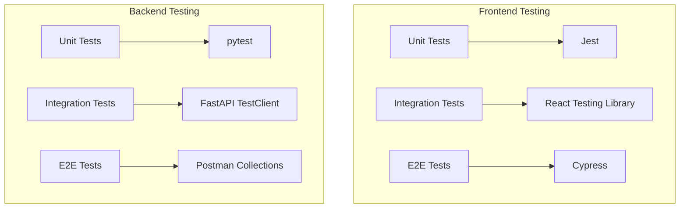
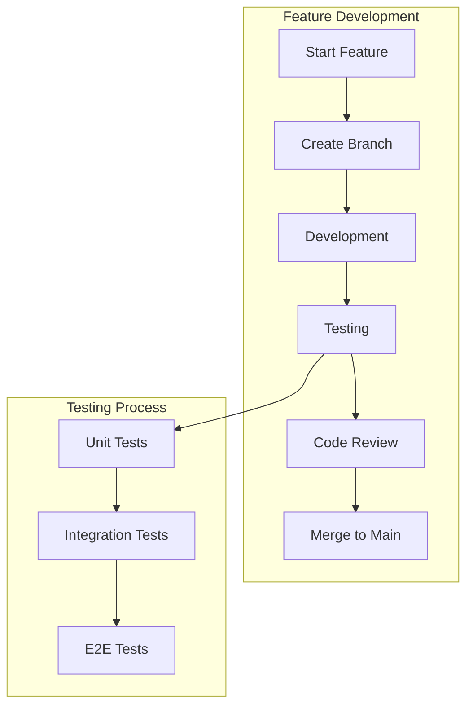
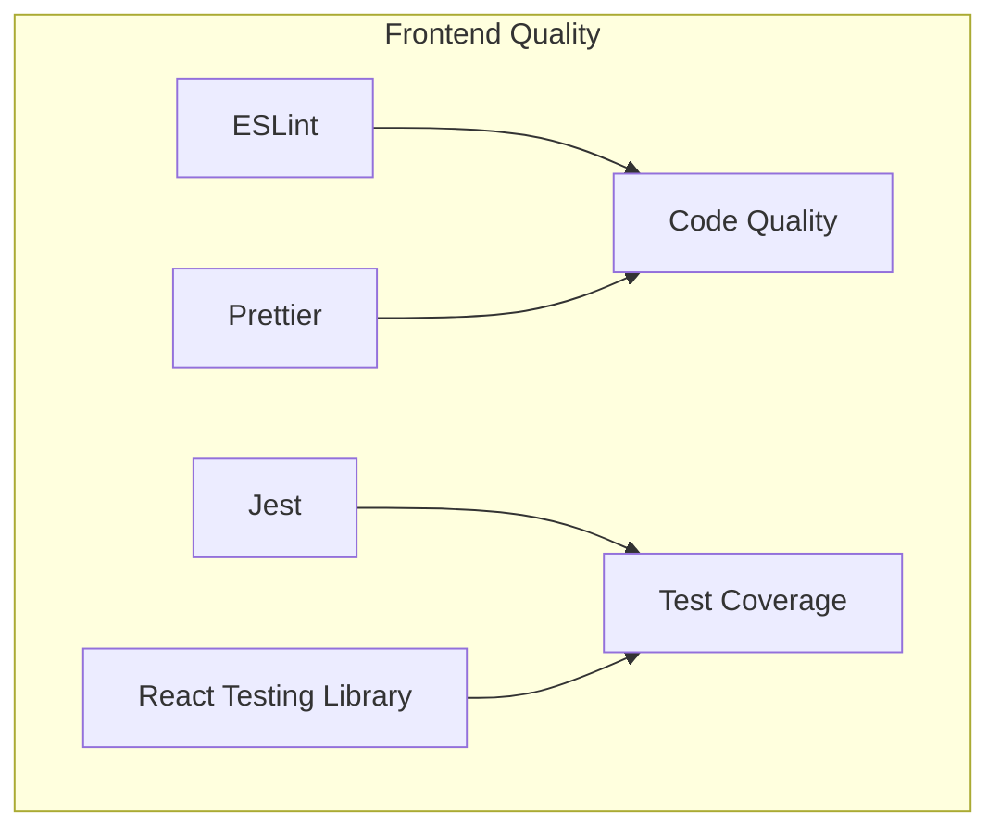
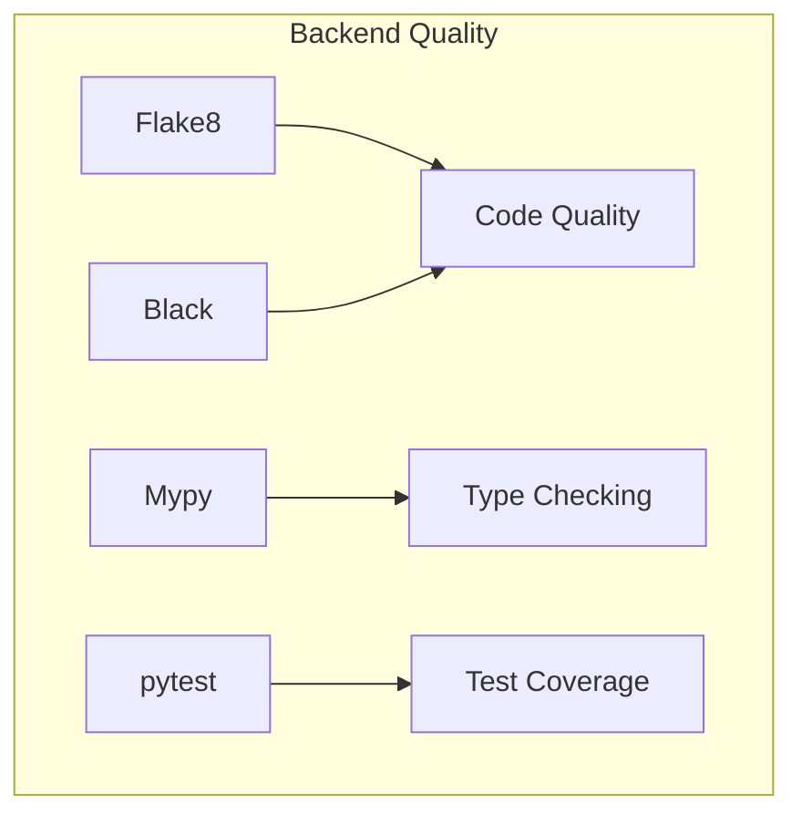
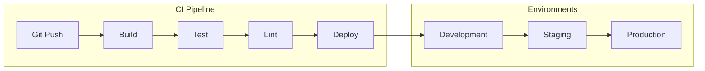
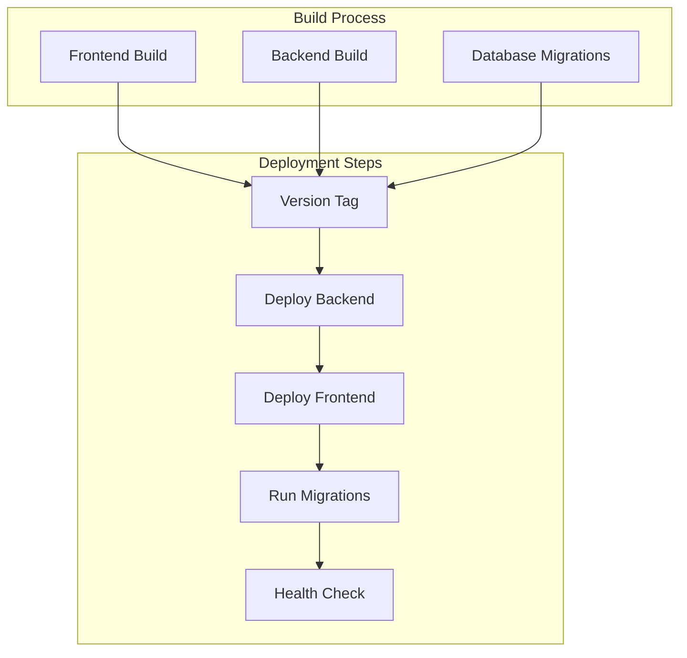

# Development Workflow

## Project Setup

```mermaid
graph TD
    subgraph "Frontend Setup"
        F1[Clone Repository]
        F2[Install Node.js]
        F3[npm install]
        F4[Configure .env]
        F5[npm run dev]
        
        F1 --> F2 --> F3 --> F4 --> F5
    end

    subgraph "Backend Setup"
        B1[Create Virtual Environment]
        B2[Install Python 3.x]
        B3[pip install requirements]
        B4[Configure .env]
        B5[Start Temporal]
        B6[Run FastAPI Server]
        
        B1 --> B2 --> B3 --> B4 --> B5 --> B6
    end
```



## Development Environment

### Frontend Development Server
```bash
# Install dependencies
npm install

# Start development server
npm run dev

# Run tests
npm test

# Build for production
npm run build
```

### Backend Development Server
```bash
# Create and activate virtual environment
python -m venv venv
source venv/bin/activate  # Unix
venv\Scripts\activate     # Windows

# Install dependencies
pip install -r requirements.txt

# Start Temporal server
docker run --network host temporalio/temporal:latest

# Run Temporal worker
python -m app.run_worker

# Start FastAPI server
uvicorn app.main:app --reload
```

## Testing Strategy



## Development Workflow



## Code Quality Tools

### Frontend


### Backend


## Continuous Integration



## Development Guidelines

### Code Style
- Frontend: ESLint + Prettier configuration
- Backend: Black + Flake8 standards
- Consistent naming conventions
- Documentation requirements

### Git Workflow
1. Feature branches from main
2. Regular commits with clear messages
3. Pull request review process
4. Squash merging to main

### Testing Requirements
1. Unit tests for new features
2. Integration tests for API endpoints
3. E2E tests for critical paths
4. Minimum coverage requirements

## Deployment Process



## Monitoring & Maintenance

### Frontend Monitoring
- Performance metrics
- Error tracking
- User analytics
- Console logging

### Backend Monitoring
- API metrics
- Database performance
- Workflow execution
- Error logging

This workflow ensures:
- Consistent development environment
- High code quality standards
- Comprehensive testing coverage
- Reliable deployment process
- Effective monitoring and maintenance
