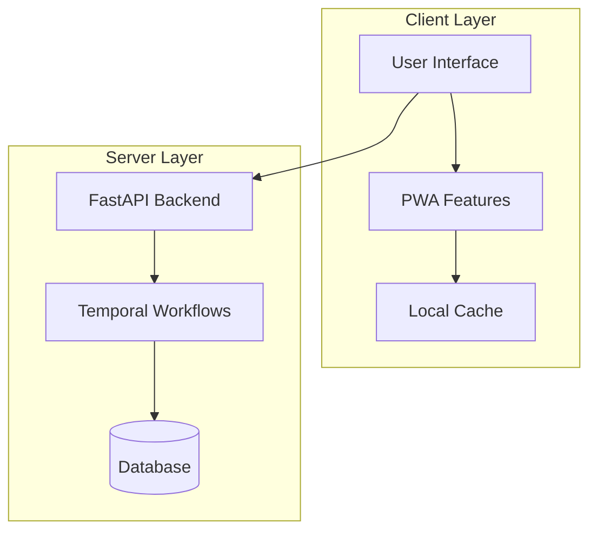

# POS System Design Documentation

This directory contains comprehensive design documentation for the POS (Point of Sale) system, using visual diagrams to explain the architecture and workflows.

## Documentation Structure

1. [System Architecture](01_system_architecture.md)
   - High-level system overview
   - Data flow patterns
   - Component integration
   - Authentication flow
   - Security measures

2. [Frontend Architecture](02_frontend_architecture.md)
   - Component hierarchy
   - State management
   - Routing structure
   - PWA capabilities
   - Performance optimizations

3. [Backend Architecture](03_backend_architecture.md)
   - FastAPI application structure
   - Database schema
   - Temporal workflow architecture
   - API endpoints
   - Security implementation

4. [Development Workflow](04_development_workflow.md)
   - Project setup
   - Development environment
   - Testing strategy
   - Code quality tools
   - Deployment process

## Key Features

### Frontend
- React-based PWA
- Material-UI components
- Offline capabilities
- Responsive design
- Real-time updates

### Backend
- FastAPI REST API
- Temporal.io workflows
- SQLite database
- JWT authentication
- Background processing

## Quick Start

1. Frontend Development:
```bash
cd frontend
npm install
npm run dev
```

2. Backend Development:
```bash
cd backend
python -m venv venv
source venv/bin/activate  # Unix
venv\Scripts\activate     # Windows
pip install -r requirements.txt
uvicorn app.main:app --reload
```

## Architecture Overview



## Development Standards

### Code Organization
- Component-based architecture
- Feature-focused structure
- Clear separation of concerns
- Consistent naming conventions

### Best Practices
- Type safety throughout
- Comprehensive testing
- Documentation requirements
- Code review process

### Quality Assurance
- Automated testing
- Code linting
- Performance monitoring
- Security scanning

## Additional Resources

- [Frontend README](../frontend/README.md)
- [Backend README](../backend/README.md)
- [API Documentation](../backend/app/README.md)
- [Testing Strategy](../backend/app/tests/README.md)

This documentation is maintained alongside the codebase and should be updated as the system evolves.
