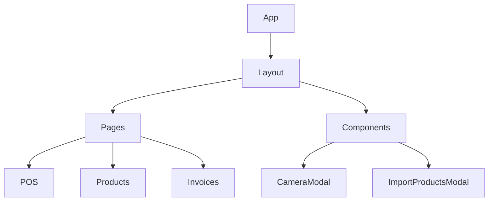
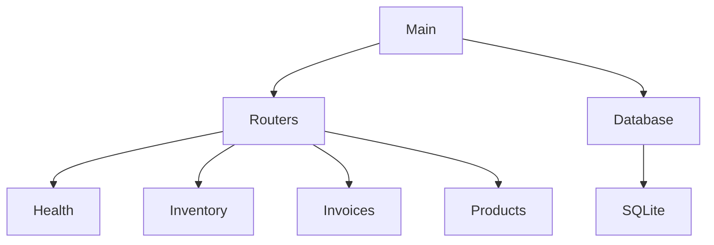

# System Patterns

## Architecture Overview
The system follows a client-server architecture with clear separation of concerns:

### Frontend Architecture

1. **React Components**
   - Layout.js: Main application structure
   - Pages: POS.js, Products.js, Invoices.js
   - Reusable Components: CameraModal.js, ImportProductsModal.js

2. **State Management**
   - Local React state for component-level data
   - API service for backend communication

### Backend Architecture

1. **FastAPI Structure**
   - Modular router organization
   - Clear endpoint separation by domain
   - SQLite database integration

2. **Data Flow**
   - RESTful API endpoints
   - JSON request/response format
   - Structured data models and schemas

## Design Patterns

### Frontend Patterns
1. **Component-Based Architecture**
   - Reusable UI components
   - Clear component hierarchy
   - Separation of concerns

2. **Service Layer Pattern**
   - Centralized API communication
   - Consistent error handling
   - Data transformation logic

3. **Responsive Design Pattern**
   - Mobile-first approach
   - Fluid layouts
   - Device-specific optimizations

### Backend Patterns
1. **Router Pattern**
   - Domain-driven route organization
   - Clear endpoint responsibilities
   - Consistent API structure

2. **Repository Pattern**
   - Database abstraction
   - Centralized data access
   - Transaction management

3. **Schema Validation**
   - Input/output validation
   - Type safety
   - Data consistency

## Integration Patterns
1. **REST API**
   - Standard HTTP methods
   - Resource-based URLs
   - Stateless communication

2. **Offline-First**
   - Local data persistence
   - Background synchronization
   - Conflict resolution

3. **Progressive Enhancement**
   - Core functionality without JavaScript
   - Enhanced features with modern browsers
   - Graceful degradation
